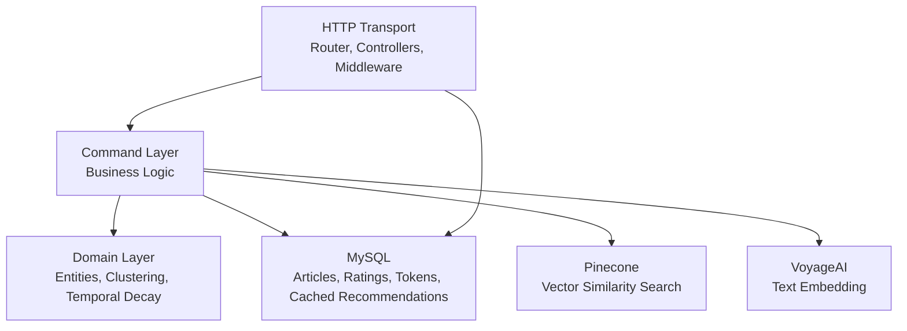
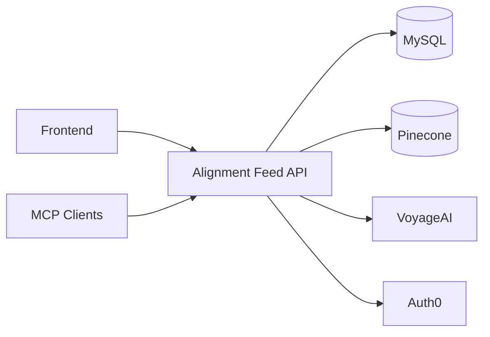
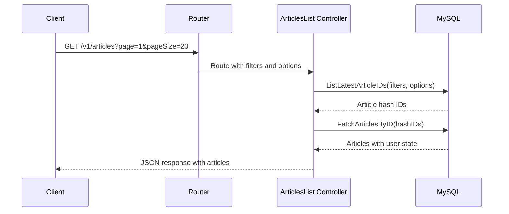
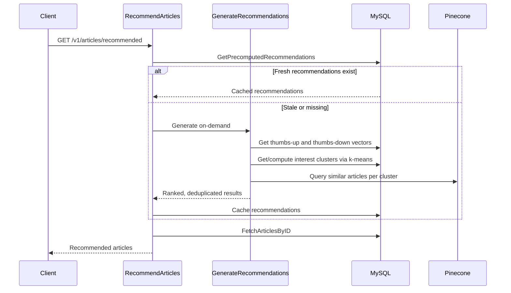
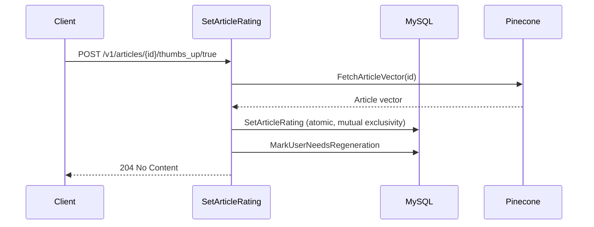

# Alignment Research Feed API

A Go REST API that serves AI alignment research articles with personalized recommendations, semantic search, and user interaction tracking. It sits between the [alignment-research-dataset](https://github.com/jbeshir/alignment-research-dataset) ingestion pipeline and the [alignment-research-feed-fe](https://github.com/jbeshir/alignment-research-feed-fe) frontend, providing article discovery, vector-based recommendations, and an RSS feed.

## Key Concepts

- **Article** -- A research paper or blog post stored with metadata (title, authors, source, publication date, summary, key points, category) and user-specific state (read, thumbs up/down).
- **User Interest Cluster** -- A k-means centroid computed from a user's positively-rated article vectors, representing a distinct area of interest. Multiple clusters capture diverse reading interests.
- **Temporal Weighting** -- Exponential decay applied to rating vectors so recent preferences influence recommendations more than older ones. Configured via a half-life parameter.
- **Precomputed Recommendation** -- A cached recommendation (article, score, source) generated by a batch job or on-demand, stored in MySQL to avoid recomputing on every request.
- **API Token** -- A user-created bearer token for programmatic access. Stored as a SHA-256 hash. Cannot be used for token management endpoints (only Auth0 sessions can manage tokens).
- **Null Driver** -- A no-op implementation of Pinecone, VoyageAI, or Auth0 that allows the API to run without those services for local development.

## Architecture Overview

The codebase follows a clean layered architecture. The transport layer handles HTTP concerns, the command layer implements business logic, the domain layer defines core types and algorithms, and datasource implementations provide storage and external service integration.



Three separate entrypoints share the same internal packages:

| Entrypoint | Purpose |
|---|---|
| `cmd/app/` | Main HTTP API server |
| `cmd/generate-recommendations/` | Batch job that precomputes recommendations for users who need regeneration |
| `cmd/mcp/` | MCP (Model Context Protocol) server for AI agent integration |

## External Dependencies

The API depends on several external services, all of which can be swapped for null drivers except MySQL.



| Service | Purpose | Required |
|---|---|---|
| MySQL | Article storage, user interactions, recommendations, API tokens | Yes |
| Pinecone | Vector similarity search for recommendations and similar articles | No (`SIMILARITY_DRIVER=null`) |
| VoyageAI | Text-to-vector embeddings for semantic search | No (`EMBEDDING_DRIVER=null`) |
| Auth0 | JWT authentication for browser sessions | No (`AUTH_DRIVERS=`) |

## Data Flow

### Article Listing



### Recommendation Generation

Recommendations combine interest clustering with temporal weighting and negative signal filtering. They are precomputed by a batch job and served from cache, falling back to on-demand generation when stale.



### Rating and Regeneration

When a user rates an article, the system stores the rating vector and flags the user for recommendation regeneration.



## Getting Started

### Prerequisites

- Go 1.25+
- Docker and Docker Compose (for local MySQL)
- Make

### Setup

1. Install development tools:

```bash
make setup-tools
```

2. Start the local MySQL database:

```bash
make docker-up
```

3. Run database migrations:

```bash
make docker-migrate
```

4. Configure environment variables. `make setup-tools` copies `.env.dist` to `.env` if it does not exist. The defaults run the API with null drivers for Pinecone, VoyageAI, and Auth0:

```bash
# .env (defaults from .env.dist)
LOG_LEVEL=DEBUG
HTTP_TLS_DISABLED=true
PORT=3000
MYSQL_URI=alignment_research_feed:pass@tcp(localhost:3306)/alignment_research_dataset
SIMILARITY_DRIVER=null
EMBEDDING_DRIVER=null
AUTH_DRIVERS=
```

5. Run the API server:

```bash
go run ./cmd/app
```

### Common Commands

| Command | Description |
|---|---|
| `make test-short` | Run unit tests |
| `make lint` | Run golangci-lint |
| `make lint-openapi` | Validate OpenAPI spec |
| `make fmt` | Format code (gofmt + goimports) |
| `make generate` | Run code generation (sqlc, mockery) |
| `make docker-test` | Run tests in Docker with a real MySQL instance |
| `make docker-mysql` | Open a MySQL CLI connected to the dev database |
| `make build-mcp` | Build the MCP server binary |

## API Reference

The full API is documented in the [OpenAPI spec](openapi/api.yaml). A rendered version can be built with `make build-openapi-docs`.

### Articles

| Method | Path | Auth | Description |
|---|---|---|---|
| `GET` | `/v1/articles` | Optional | Paginated article list with filters (source, date, title, author, category) |
| `GET` | `/v1/articles/{article_id}` | Optional | Single article by hash ID |
| `GET` | `/v1/articles/{article_id}/similar` | Optional | Up to 10 similar articles via vector similarity |
| `POST` | `/v1/articles/semantic-search` | Optional | Semantic search by text query |
| `GET` | `/v1/articles/recommended` | Required | Personalized recommendations (1-100 results) |
| `GET` | `/v1/articles/unreviewed` | Required | Articles not yet read or rated |
| `GET` | `/v1/articles/liked` | Required | Articles with thumbs up |
| `GET` | `/v1/articles/disliked` | Required | Articles with thumbs down |

### User Interactions

| Method | Path | Auth | Description |
|---|---|---|---|
| `POST` | `/v1/articles/{article_id}/read/{read}` | Required | Mark article as read/unread |
| `POST` | `/v1/articles/{article_id}/thumbs_up/{thumbs_up}` | Required | Set thumbs up (clears thumbs down) |
| `POST` | `/v1/articles/{article_id}/thumbs_down/{thumbs_down}` | Required | Set thumbs down (clears thumbs up) |

### API Tokens

| Method | Path | Auth | Description |
|---|---|---|---|
| `GET` | `/v1/tokens` | Auth0 only | List user's API tokens |
| `POST` | `/v1/tokens` | Auth0 only | Create a new API token (max 10 active) |
| `DELETE` | `/v1/tokens/{token_id}` | Auth0 only | Revoke a token |

### RSS

| Method | Path | Auth | Description |
|---|---|---|---|
| `GET` | `/rss` | No | RSS 2.0 feed (supports same filters as article listing) |

### Authentication

Two authentication methods are supported, identified by the bearer token prefix:

- **Auth0 JWT:** `Authorization: Bearer auth0|<jwt_token>` -- for browser sessions. Can access all endpoints including token management.
- **API Token:** `Authorization: Bearer user_api|<token>` -- for programmatic access. Cannot manage tokens.

Unauthenticated requests can access public endpoints (article listing, single article, similar articles, semantic search, RSS).
